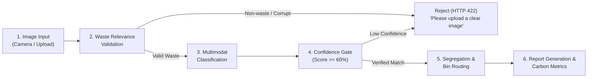

# EcoSort AI

> **Intelligent Waste Classification & Circular Economy Segregation Platform**

[](https://github.com/yukthivarma27-code/EcoSort)
[](https://react.dev/)
[](https://www.typescriptlang.org/)
[](https://vitejs.dev/)
[](https://tailwindcss.com/)
[](LICENSE)

---

## 1. Project Overview

Municipal and enterprise waste sorting systems struggle with contamination rates exceeding 25%, largely driven by ambiguous consumer packaging, composite materials, and unclear localized recycling rules. Incorrectly sorted waste damages automated sorting machinery, diverts recyclable feedstock to landfills, and increases municipal processing costs.

**EcoSort AI** solves this challenge through an intelligent computer vision and multi-modal classification pipeline. Users can capture or upload an image of any waste item, and the system performs automated waste-relevance validation, multi-class categorization, actionable preparation steps, target bin assignment, and carbon diversion metrics.

---

## 2. Key Features

- **Live Capture & Upload**: Supports real-time camera snapshots and direct file uploads with client-side canvas optimization.
- **Two-Stage Waste Validation**: Gatekeeper check rejects non-waste subjects (people, pets, vehicles, landscapes, screenshots) before classification.
- **12-Class Categorization**: Trained and aligned with standard municipal garbage datasets across 12 distinct material streams.
- **Confidence Scoring & Thresholds**: Transparent classification confidence metrics; flags low-confidence predictions.
- **Actionable Segregation Steps**: Step-by-step cleaning, preparation, and contamination prevention protocols.
- **Environmental Impact Analytics**: Computes avoided CO₂ emissions (kg), conserved energy (kWh), and preserved water (L).
- **Circular Economy Recommendations**: Generates creative upcycling and secondary reuse suggestions for circular resource management.
- **Compliance Audit Reports**: Generates exportable text/PDF summary reports for enterprise compliance logs.
- **Interactive Analytics Dashboard**: Visualizes stream distribution and historical session trends using Recharts.

---

## 3. How It Works

The classification pipeline follows a strict six-stage lifecycle:



1. **Image Input**: Base64 payload captured via webcam or uploaded from disk. Client-side canvas downscales raw images to ensure sub-second transmission.
2. **Relevance Validation**: System validates that the image depicts an actual physical object and checks against non-waste heuristics (e.g. portraits, animals, code, landscapes).
3. **Classification**: The multimodal vision model processes the visual features and extracts material composition, brand markers, and classification signatures.
4. **Confidence Verification**: Confirms prediction certainty (minimum 60% confidence threshold).
5. **Segregation Routing**: Maps the identified material to the correct municipal container (Blue, Green, Yellow, Red, or Gray bin).
6. **Report Generation**: Emits structured JSON containing composition percentages, preparation protocols, circular economy upcycling ideas, and environmental savings.

---

## 4. Dataset & Classification Categories

EcoSort AI is designed around the **Garbage Classification (12 Classes)** dataset (`mostafaabla/garbage-classification`), consisting of **15,515 verified images** across 12 distinct categories:

| # | Class Name | Dataset Count | Share (%) | Primary Category | Target Bin | Color Code |
| :-: | :--- | :-: | :-: | :--- | :--- | :---: |
| 1 | `battery` | 945 | 6.09% | E-Waste & Hazardous | Red Bin (E-Waste / Hazardous) | `#dc2626` |
| 2 | `biological` | 985 | 6.35% | Compostable & Organic | Green Bin (Compost/Organics) | `#16a34a` |
| 3 | `brown-glass` | 607 | 3.91% | Glass & Glassware | Blue Bin (Recycling) | `#2563eb` |
| 4 | `cardboard` | 891 | 5.74% | Paper & Cardboard | Yellow Bin (Paper/Cardboard) | `#eab308` |
| 5 | `clothes` | 5,325 | 34.32% | Textiles & Garments | Gray Bin (General / Donation) | `#4b5563` |
| 6 | `green-glass` | 629 | 4.05% | Glass & Glassware | Blue Bin (Recycling) | `#2563eb` |
| 7 | `metal` | 769 | 4.96% | Metal & Aluminum | Blue Bin (Recycling) | `#2563eb` |
| 8 | `paper` | 1,050 | 6.77% | Paper & Cardboard | Yellow Bin (Paper/Cardboard) | `#eab308` |
| 9 | `plastic` | 865 | 5.58% | Recyclable Plastics | Blue Bin (Recycling) | `#2563eb` |
| 10 | `shoes` | 1,977 | 12.74% | Footwear & Rubber | Gray Bin (General / Special Depot) | `#4b5563` |
| 11 | `trash` | 697 | 4.49% | Non-Recyclable Residuals | Gray Bin (General Landfill) | `#4b5563` |
| 12 | `white-glass` | 775 | 5.00% | Glass & Glassware | Blue Bin (Recycling) | `#2563eb` |
| **Total** | **12 Classes** | **15,515** | **100.0%** | — | — | — |

---

## 5. Technology Stack

### Frontend
- **Framework**: React 19 (`react`, `react-dom`)
- **Language**: TypeScript 5.8
- **Build Tool**: Vite 6.2
- **Styling**: Tailwind CSS v4 (`@tailwindcss/vite`)
- **Icons & UI**: Lucide React (`lucide-react`)
- **Charts & Visualization**: Recharts (`recharts`)
- **Animations**: Motion (`motion`)

### Backend & API
- **Local Dev Server**: Node.js + Express 4.21 with `tsx` watch mode
- **Production Serverless**: Vercel Serverless Functions (`api/classify.ts`, `api/health.ts`)
- **AI SDK**: Google Gen AI SDK (`@google/genai` v2.4.0)
- **Environment Management**: `dotenv` with dynamic runtime reload

### Machine Learning & Data Pipeline
- **Dataset Integration**: Kaggle API (`kagglehub`)
- **Image Processing**: Pillow (`PIL`), NumPy
- **Analysis Scripts**: Python 3.10+ dataset inspection and integrity verification

---

## 6. Project Directory Structure

```text
ecosort-ai/
├── api/                             # Vercel Serverless Function handlers
│   ├── classify.ts                  # Production serverless classification endpoint
│   └── health.ts                    # Production serverless health check endpoint
│
├── src/                             # React 19 Frontend application
│   ├── components/                  # UI Components
│   │   ├── AnalyticsDashboard.tsx   # Visual charts, trends, and diversion rates
│   │   ├── ErrorBoundary.tsx        # React runtime error boundary
│   │   ├── Footer.tsx               # Footer with legal and system status triggers
│   │   ├── Header.tsx               # Navigation bar and stream switcher
│   │   ├── KnowledgeCatalog.tsx     # Material sorting knowledge base
│   │   ├── LegalModals.tsx          # Privacy policy, terms, and contact modals
│   │   └── WasteClassifier.tsx      # Core camera, upload, and classification UI
│   ├── data/
│   │   └── presets.ts               # Standard pre-loaded sample items
│   ├── types.ts                     # TypeScript interfaces and data contracts
│   ├── App.tsx                      # Root application layout and tab router
│   ├── index.css                    # Tailwind CSS v4 global styling
│   └── main.tsx                     # React DOM mount entrypoint
│
├── ml/                              # Machine Learning & Dataset tools
│   ├── scripts/
│   │   ├── download_dataset.py      # Automated Kaggle dataset downloader
│   │   └── inspect_dataset.py       # Data verification, duplicate check & report generator
│   ├── dataset_report.json          # Verified dataset metrics and class distributions
│   └── dataset_report.md            # Markdown dataset audit summary
│
├── dataset/                         # Local dataset directory (gitignored)
│   └── raw/
│       └── garbage_classification/  # 12 raw image class subdirectories
│
├── server.ts                        # Local Express server with Vite middleware integration
├── vercel.json                      # Vercel deployment routing and SPA rewrites
├── package.json                     # Node dependencies and build scripts
├── tsconfig.json                    # TypeScript compiler configuration
├── vite.config.ts                   # Vite bundler and Tailwind plugin configuration
└── .gitignore                       # Repository exclusion rules
```

---

## 7. Installation & Setup

### Prerequisites
- **Node.js**: `v18.0.0` or higher
- **npm**: `v9.0.0` or higher
- **Python**: `v3.10+` (optional, only for running local ML dataset tools)

### Step 1: Clone Repository
```bash
git clone https://github.com/yukthivarma27-code/EcoSort.git
cd EcoSort
```

### Step 2: Install Node Dependencies
```bash
npm install
```

### Step 3: Configure Environment Variables
Create a `.env` file in the root directory:
```env
GEMINI_API_KEY=your_gemini_api_key_here
PORT=3000
```

> **Note**: If `GEMINI_API_KEY` is omitted, the application automatically activates its deterministic local fallback classification engine for keyless development and offline demonstration.

### Step 4: Run Development Server
```bash
npm run dev
```
Open **[http://localhost:3000](http://localhost:3000)** in your browser.

### Step 5: Build for Production
```bash
npm run build
```

---

## 8. Deployment

### Vercel (Recommended)
This repository is configured for native Vercel deployment:
1. Import the repository into your [Vercel Dashboard](https://vercel.com/new).
2. Set the build settings:
   - **Framework Preset**: `Vite`
   - **Build Command**: `vite build`
   - **Output Directory**: `dist`
3. Add `GEMINI_API_KEY` under **Project Settings → Environment Variables**.
4. Deploy. Vercel automatically deploys the frontend SPA and compiles the `/api` serverless endpoints.

### Self-Hosted / Node.js
```bash
npm run build
npm start
```
The server will start using `dist/server.cjs` and dynamically bind to the port specified in `process.env.PORT`.

---

## 9. API Reference

### 1. Classify Waste Item
- **Endpoint**: `POST /api/classify`
- **Headers**: `Content-Type: application/json`

**Request Body**:
```json
{
  "imageBase64": "data:image/jpeg;base64,...",
  "textPrompt": "Optional user notes or material description"
}
```

**Successful Response (`HTTP 200`)**:
```json
{
  "id": "scan-1786468854936",
  "timestamp": "2026-08-11T17:20:54.936Z",
  "isValidWaste": true,
  "datasetClass": "plastic",
  "itemName": "Plastic Beverage Bottle / Container",
  "brandOrModel": "PET (#1) Recyclable Polymer",
  "category": "Recyclable Plastics",
  "primaryBin": "Blue Bin (Recycling)",
  "binColor": "#2563eb",
  "confidence": 96,
  "recyclabilityScore": 92,
  "contaminationRisk": "Low",
  "composition": [
    { "material": "Polyethylene Terephthalate (PET #1)", "percentage": 94 },
    { "material": "Polypropylene Closure (PP #5)", "percentage": 6 }
  ],
  "segregationSteps": [
    "Empty any leftover liquids completely into sink",
    "Rinse lightly with clean water",
    "Compress or crush bottle to maximize bin volume and deposit in blue recycling bin"
  ],
  "impact": {
    "co2SavedKg": 0.19,
    "energySavedKwh": 0.38,
    "waterSavedLiters": 1.5,
    "decompositionYears": 450
  },
  "upcyclingIdeas": [
    "Repurpose as an automated slow-drip watering funnel for houseplants",
    "Convert into modular organization caddies for small screws or stationery"
  ],
  "localDisposalNotice": "Compliant with ISO 14001 municipal recycling protocols for curbside PET collection.",
  "aiNotes": "Analyzed via EcoSort AI Vision Engine. Clear thermoplastic polymer signature confirmed."
}
```

**Rejection Response (`HTTP 422`)**:
```json
{
  "error": "Please upload or capture a clear image of a waste item.",
  "isValidWaste": false
}
```

### 2. Service Health Check
- **Endpoint**: `GET /api/health`
- **Response (`HTTP 200`)**:
```json
{
  "status": "ok",
  "service": "EcoSort AI Waste Intelligence Engine",
  "version": "2.4.0",
  "timestamp": "2026-08-11T17:20:09.112Z"
}
```

---

## 10. Verification & Quality Assurance

To validate the TypeScript codebase and verify build artifacts:

```bash
# Run TypeScript compilation check
npm run lint

# Run full Vite & esbuild production build
npm run build
```

To run the dataset inspection script:
```bash
python ml/scripts/inspect_dataset.py
```

---

## 11. Limitations & Future Roadmap

### Current Limitations
- **Multi-Object Images**: Best performance is achieved when a single primary waste item is in focus. Cluttered multi-item scenes may prioritize the dominant foreground object.
- **Regional Regulatory Variance**: Municipal sorting color codes and rules differ across jurisdictions (e.g. dual-stream vs. single-stream recycling).

### Future Roadmap
- [ ] Multi-object bounding-box detection for concurrent sorting of mixed waste heaps.
- [ ] Geolocation-based municipal rule customization (adjusting bin colors and protocols by postal code).
- [ ] Offline WebAssembly (WASM) / TensorFlow.js edge model inference for zero-latency in-browser classification without cloud API calls.
- [ ] Barcode and resin identification code (RIC) optical character recognition.

---

## 12. Contributing

Contributions are welcome. Please follow standard GitHub workflow:
1. Fork the repository.
2. Create a feature branch (`git checkout -b feature/improved-segregation-rules`).
3. Commit your changes (`git commit -m 'feat: add enhanced resin identification rules'`).
4. Push to the branch (`git push origin feature/improved-segregation-rules`).
5. Open a Pull Request.

---

## 13. License

This project is licensed under the **MIT License**. See the [LICENSE](LICENSE) file for details.
